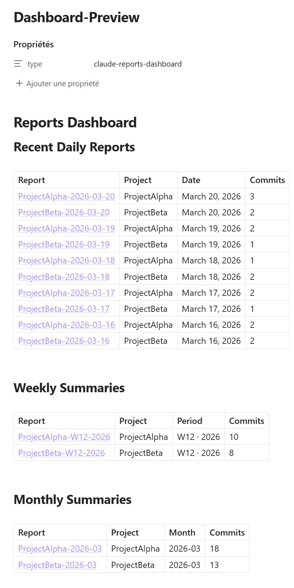
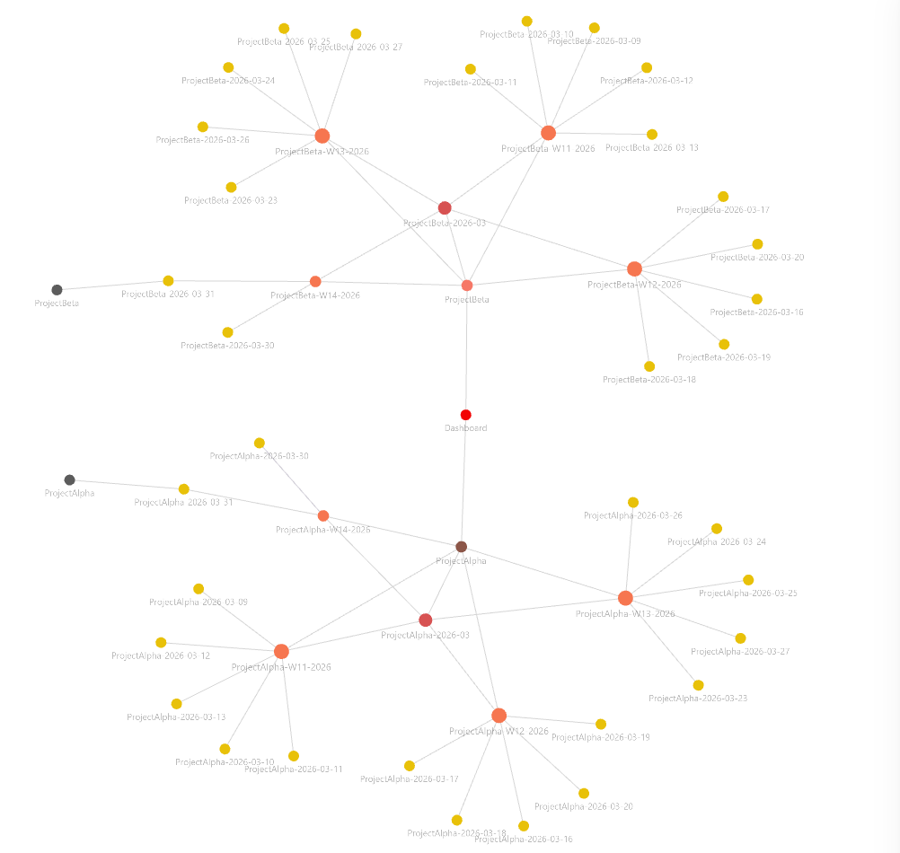

# claude-obsidian-reporter

[](LICENSE)
[](https://claude.ai/claude-code)

> Type `/report-orchestrator` at the end of your day. Claude reads your Git commits, writes a structured report, and saves it directly into your Obsidian vault.

That's it. No copy-pasting, no manual writing. Just one command.

 

## What you get

| When you run it | Reports written |
|---|---|
| Any day | Daily report |
| Friday | Daily + Weekly summary |
| Last day of month | Daily + Monthly summary |
| First install on existing project | Run `backfill=all` or `backfill=YYYY-MM-DD` — generates everything from day one or from a chosen date |

Forgot to run it yesterday? No problem — the skill **auto-detects missing days** from the current week and fills them automatically.

## Prerequisites

- [Obsidian](https://obsidian.md) with the **Obsidian CLI** community plugin enabled
- [Claude Code](https://claude.ai/claude-code) installed and authenticated
- Git 2.x+
- [Dataview](https://github.com/blacksmithgu/obsidian-dataview) plugin (optional — required for the auto-generated dashboard)

## Install

```bash
git clone https://github.com/sinaayyy/claude-obsidian-reporter.git
cd claude-obsidian-reporter
bash setup-local.sh
```

On Windows: double-click `install-windows.bat` instead.

Then open `.env` and fill in:

```bash
VAULT_NAME=MyNotes              # folder name shown in Obsidian's title bar
VAULT_PATH=/home/user/MyNotes   # absolute path to your vault
LANGUAGE=English                # optional — any language: French, Spanish, Japanese...
```

Finally, add your projects to `projects.config`:

```
# ProjectName | /absolute/path/to/repo | optional_git_url
MyApp|/home/user/projects/my-app|
```

## Usage

```
/report-orchestrator                          ← today
/report-orchestrator date=2026-03-14          ← specific date
/report-orchestrator language=French          ← reports in French
```

Open Claude Code in the `claude-obsidian-reporter` directory (where `projects.config` lives) and run the command. Reports appear in your vault instantly — no need to have Obsidian open.

### Already have an existing project?

If your project has weeks or months of Git history, you don't start from scratch — use `backfill` to generate all missing reports in one shot:

```
# Backfill from the very first commit
/report-orchestrator backfill=all

# Backfill from a chosen date
/report-orchestrator backfill=2025-11-01
```

The skill walks every day from the backfill date to today, skips days that already have a report, and auto-generates daily, weekly (Fridays), and monthly (last day of month) reports for each gap. Your vault goes from empty to fully populated in a single run.

## Vault structure

Reports are organized so you can navigate month → week → day:

```
Reports/
├── Current/
│   └── ProjectName.md              ← link to today's daily (always up to date)
└── ProjectName/
    └── YYYY-MM/
        ├── ProjectName-YYYY-MM.md  ← monthly report
        └── WNN/
            ├── ProjectName-WNN-YYYY.md   ← weekly report
            └── Daily/
                ├── ProjectName-YYYY-MM-DD.md
                └── ...
```

## Customizing report templates

Edit the files in `Templates/` to change the format of your reports:

| File | Used for |
|---|---|
| `Templates/daily-report-template.md` | Every daily report |
| `Templates/weekly-report-template.md` | Friday weekly reports |
| `Templates/monthly-report-template.md` | End-of-month reports |

Available placeholders:

| Placeholder | Content |
|---|---|
| `{{project}}` | Project name |
| `{{date}}` / `{{week}}` / `{{month}}` / `{{year}}` | Date fields |
| `{{nb_commits}}` | Number of commits |
| `{{liste_commits}}` | Formatted commit list |
| `{{resume_taches}}` | AI-generated summary (respects `LANGUAGE`) |
| `{{highlights}}` | Key wins/themes (monthly only) |
| `{{daily_links}}` | Wikilinks to daily reports (weekly template) |
| `{{weekly_links}}` | Wikilinks to weekly reports (monthly template) |
| `{{parent_weekly}}` | Wikilink to the weekly report — used as `parent` in daily frontmatter |
| `{{parent_monthly}}` | Wikilink to the monthly report — used as `parent` in weekly frontmatter |
| `{{parent_project}}` | Wikilink to the project index — used as `parent` in monthly frontmatter |

After editing a template, regenerate existing reports with the `backfill` parameter:

```
# Single day (reports are always overwritten on re-run)
/report-orchestrator date=2026-03-18

# Date range (via the shell wrapper — requires Claude Code installed and authenticated)
bash scripts/catchup-missed-days.sh --from 2026-03-01 --to 2026-03-31 --force
```

See [`examples/output/`](examples/output/) for what filled reports look like.

## Cost

Each run uses Claude to generate the AI summaries. Estimates based on Claude Sonnet pricing:

| Run type | Estimated cost |
|---|---|
| Daily (1 project, ~5 commits/day) | ~$0.01 |
| Daily + Weekly | ~$0.01–0.02 |
| Daily + Monthly | ~$0.02–0.04 |
| Each additional project | +~$0.005 |
| `backfill=all` on a 6-month project | ~$0.50–1.00 |

Cost scales with commit volume and number of projects. A team of 3 projects running daily for a month ≈ **$0.60–1.50/month**.

## Troubleshooting

**`obsidian: command not found`**
→ Enable the Obsidian CLI community plugin in Obsidian (Settings → Community plugins).

**Commands fail on Windows (exit 127)**
→ Git Bash resolves `obsidian` to `Obsidian.exe` instead of `Obsidian.com`. Fix with a wrapper:
```bash
mkdir -p ~/bin
echo '#!/bin/bash' > ~/bin/obsidian
echo '"/c/Users/$USERNAME/AppData/Local/Programs/Obsidian/Obsidian.com" "$@"' >> ~/bin/obsidian
chmod +x ~/bin/obsidian
```

**`VAULT_NAME is not set`**
→ Open `.env` and set `VAULT_NAME` to the vault folder name shown in Obsidian's title bar.

**`ERROR: '$PROJECT_PATH' is not a git repository`**
→ The path doesn't exist or was never cloned. Add a `git_url` to auto-clone, or clone manually first.

**`Clone failed for https://...`**
→ Set `GITHUB_TOKEN=your_token` in `.env` for private HTTPS repos.

## License

[MIT](LICENSE)
